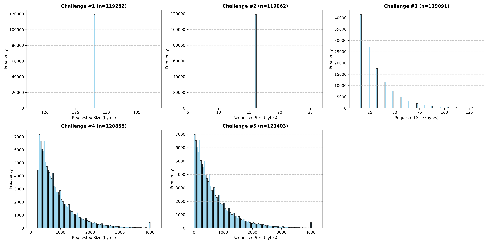

# week7 assigment

実行メモ

``` 
cd google-step-2026/week7/

# move into malloc dir
cd malloc_challenge
cd malloc

# build
make

# run a benchmark (for score board)
make run

```

## Best Fitにするために

1. どのスロットが最終的な対象となるか格納する変数`best`を用意する。この変数は各時点でサイズより大きいスロットの中で最も小さいサイズのスロットの情報が格納されている。
2. 各空いているスロットに対して、
    - ①sizeより大きいか
    - ②もし大きければ、現在の`best`のサイズと比較し、その`best`より小さければ、更新する。

#### 予想

- 【Speed】: 遅くなる
    - 毎回全ての空いているスロットを確認する必要があるため。
- 【Utilization】:良くなる
    - First Fitでは、対象のサイズより大きすぎるスロットであっても入れていくため、大きいサイズが入らなくなる可能性が高い。一方、Best Fitにすることで空いているサイズの合計がサイズより大きいのに入らないケースが少なるなることでUtilizationが改善されると考えられる。

#### 結果
```
====================================================
Challenge #1    |   simple_malloc =>       my_malloc
--------------- + --------------- => ---------------
       Time [ms]|              13 =>            1381
Utilization [%] |              70 =>              70
====================================================
Challenge #2    |   simple_malloc =>       my_malloc
--------------- + --------------- => ---------------
       Time [ms]|              17 =>             537
Utilization [%] |              40 =>              39
====================================================
Challenge #3    |   simple_malloc =>       my_malloc
--------------- + --------------- => ---------------
       Time [ms]|             139 =>             796
Utilization [%] |               8 =>              51
====================================================
Challenge #4    |   simple_malloc =>       my_malloc
--------------- + --------------- => ---------------
       Time [ms]|           35370 =>           11270
Utilization [%] |              16 =>              72
====================================================
Challenge #5    |   simple_malloc =>       my_malloc
--------------- + --------------- => ---------------
       Time [ms]|           18478 =>            7200
Utilization [%] |              15 =>              72
```

## Freelist binの実装

- まず、mallocのサイズの分布を調べてみると以下の通りになる。


