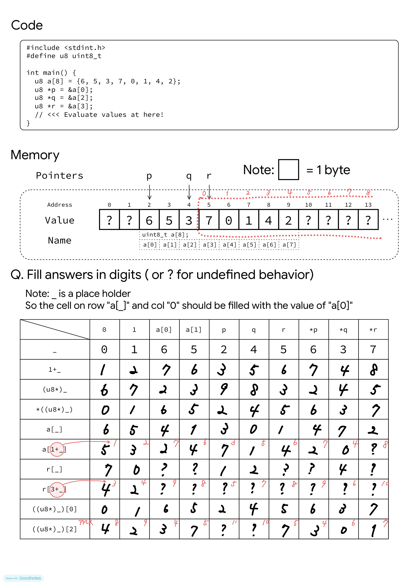

# ポインタ百マス計算を解いた結果

  

## 補足：C言語の式と意味の対応表

| 式（コード） | 意味・解釈 | 得られるデータ（型） |
| :--- | :--- | :--- |
| `1 + x` | `x` に `1` を足す | 単なる数値（計算結果） |
| `(u8*)x` | `x` の値が格納されているアドレス | アドレス（ポインタ） |
| `*((u8*)x)` | `(u8*)x` のアドレスに格納されている値（`x` と同じ） | 中身の値（データ） |
| `a[x]` | 配列 `a` で `x` 番目の値 | 中身の値（データ） |
| `a[1 + x]` | 配列 `a` で `x + 1` 番目の値 | 中身の値（データ） |
| `r[x]` | ポインタ `r` が指すアドレスを `index: 0` としたときの `x` 番目の値 | 中身の値（データ） |
| `r[3 + x]` | ポインタ `r` が指すアドレスを `index: 0` としたときの `x + 3` 番目の値 | 中身の値（データ） |
| `((u8*)x)[0]` | `x` の値が格納されているアドレスに格納されている値（`*((u8*)x)` や `x` と同じ） | 中身の値（データ） |
| `((u8*)x)[2]` | （`x` の値が格納されているアドレス + 2）のアドレスに格納されている値 | 中身の値（データ） |
